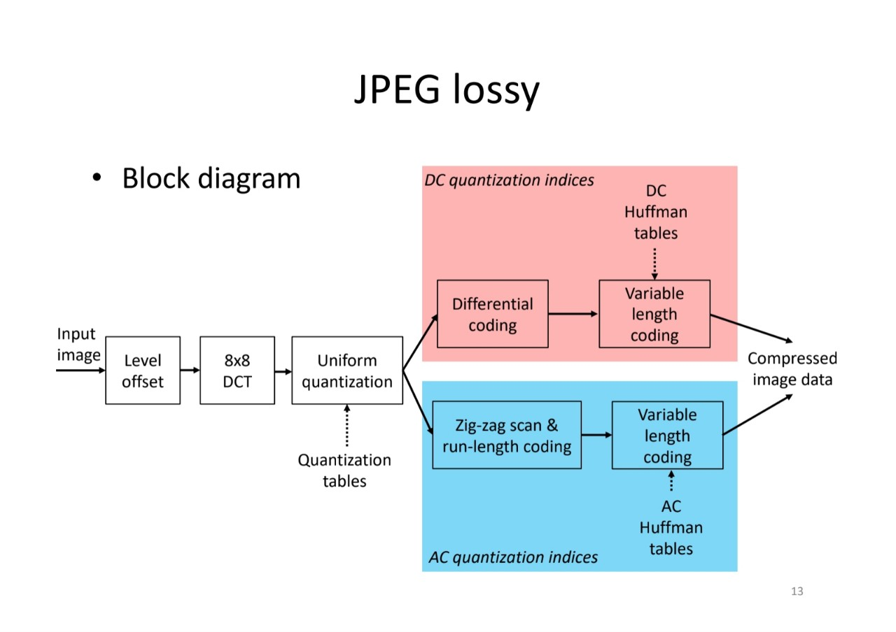

# jpeg compression

jpeg compression coded with python
 

directory에 있는 이미지를 q factor에 따라 jpeg으로 encoding 한 후 decoding 하여 다시 복원 하여 
psnr과 ssim을 이용하여 원본과 얼마만큼 비슷한지를 측정(얼마만큼 손실되었는지)

## 1. jpeg lossy Block Diagram

## 2. 실행 과정(decoding은 encoding과 역과정이기 떄문에 생략)

1. cv2 img read
2. YCbCr
3. chroma subsampling
4. transform to block
5. 8X8 DCT
6. quantization
7. zig-zag scan & run-length coding
